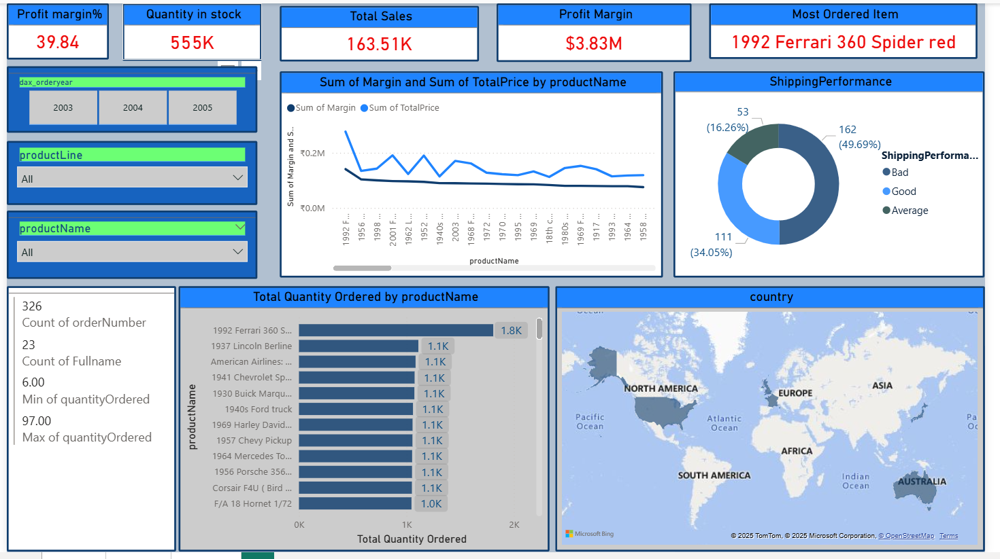
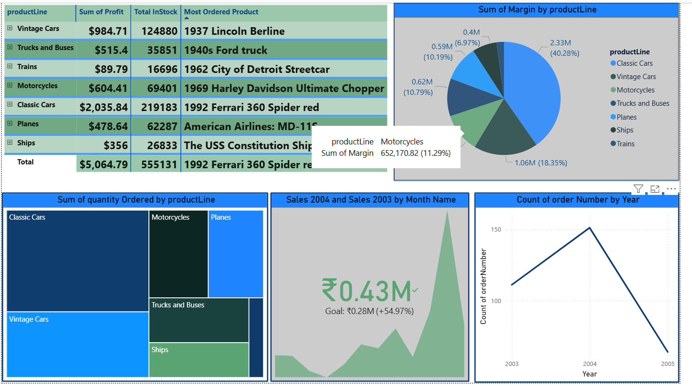

# 🚀 Classic Dataset Analytics (Power BI)

Built an **end-to-end analytics solution in Power BI** to evaluate multi-vehicle product line performance, clean messy raw data, and generate insights for **profitability, logistics, and inventory optimization**.  

---

## 📝 Overview  
This project converts **unstructured and inconsistent sales records** into a **business-ready analytics dashboard**. By cleaning and modeling the dataset in Power BI, it provides a **single source of truth** for decision-making.  

It offers leadership visibility into **sales trends, product profitability, shipping performance, and inventory management**, enabling **better strategic and operational decisions**.  

---

## ❓ Problem Statement
The company’s multi-vehicle sales data was fragmented, messy, and inconsistent, making it difficult to measure profitability, sales trends, and shipping quality. Leadership lacked a unified view to identify top-performing products, detect underperforming segments, and address operational inefficiencies like high inventory holding and poor shipment quality. This project aimed to transform raw data into a structured, insight-driven analytics solution using Power BI..  

👉 This project was initiated to **standardize data, unify reporting, and extract actionable insights** for improving profitability and operational efficiency.  

---

## ⚡ Challenges & Solutions  

| Challenge | Solution Implemented | Impact |
|-----------|----------------------|--------|
| Messy, inconsistent data (nulls, duplicates, mislabels) | Cleaned and standardized in **Power Query** | Increased data accuracy & reliability |
| Lack of structured model | Built **star schema** (Orders, Products, Calendar) | Enabled scalable reporting & performance |
| No clear KPIs for profit & growth | Developed **DAX measures** (Sales, Profit, Margin %, YoY Growth) | Provided executives with key financial metrics |
| Hard to drill into details | Added **tooltip dashboard** | Allowed instant product-level insights |
| Hidden logistics issues | Created **Shipping Quality analysis** | Exposed 15% bad shipments → opportunity for cost reduction |

---

## 📂 Dataset  
- **Source**: Classic Models Dataset.  
- **Size**: 5,000+ transactional records.  
- **Key Fields**: Order ID, Product Line, Quantity, Sales, Profit, Margin %, Shipment Quality, Year.  

---

## 🛠 Tools and Technologies  
- **Power BI** → Data cleaning (Power Query), Modeling, Dashboards.  
- **DAX** → Advanced metrics and KPIs.  

---

## ⚙️ Methods  
- Removed **nulls, duplicates, and inconsistent product labels**.  
- Standardized date formats and built **star schema model**.  
- Created KPIs: **Total Sales, Total Profit, Profit Margin %, YoY Growth %**.  
- Designed interactive dashboards with **slicers, filters, and tooltip drill-throughs**.  

---

## 🔑 Key Insights  
- **Classic Cars → 40% of total profits**, strongest product line.  
- **Motorcycles & Vintage Cars → Consistent growth, strong customer demand.**  
- **Trains & Ships → Weak segments**, require strategy review or divestment.  
- **2004 was peak year**, but sales **declined sharply in 2005**, indicating demand saturation.  
- **555K+ units in inventory → overstocking risk**.  
- **15% bad shipments** → logistics inefficiency needs process improvement.  

---

## 📊 Dashboard / Model / Output  

### 🔹 Dashboard 1 – Sales & Profit Overview
- Total Sales, Profit, Margin % (KPIs).  
- Top Ordered Products by Quantity & Profit.  
- Sales Trends by Year (2003–2005).  
- Product Line performance (Bar & Pie charts).  

---

### 🔹 Dashboard 2 – Product Line & Shipping Insights
- Comparative performance of **7 product lines**.  
- Order quantity distribution across categories.  
- Sales of year 2004 and 2003.

---

### 🔹 Tooltip Dashboard
- Drill-down per-product KPIs.  
- Enables interactive exploration without leaving the main dashboard.  
---

## 🖥️ How to Run this Project?  
1. Clone this repo.  
2. Download the `.pbix` file.  
3. Open in **Power BI Desktop**.  
4. Refresh dataset and explore dashboards interactively.  

---

## 📈 Results & Conclusion  
✅ Improved **data quality** by cleaning inconsistent raw records.  
✅ Delivered a **single dashboard** for end-to-end product and logistics tracking.  
✅ Helped identify **profit leaders (Classic Cars)** and **loss areas (Trains, Ships)**.  
✅ Insights support **better inventory planning** and **cost reduction in logistics**.  

---

## 🔮 Future Work  
- Add **real-time SQL/cloud data refresh**.  
- Include **forecasting (time-series analysis)** for future sales trends.  
- Expand to **geographical dashboards** for regional insights.  
- Automate **alerts for declining product lines** and poor shipping quality.  

---
## ✍️ Author
**Sehr Qureshi**  
📧 Email: **qureshisehr123@gmail.com**  
🔗 LinkedIn: [**Sehr Qureshi**](https://www.linkedin.com/in/sehr-qureshi-b0a9822b1)

--- 
⭐ *If you find this project valuable, please star the repo!*  

